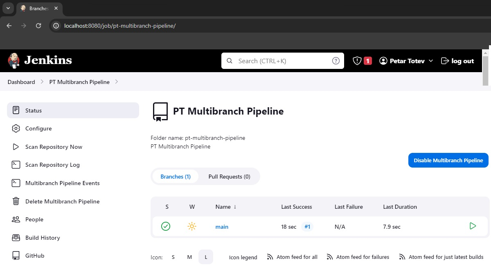
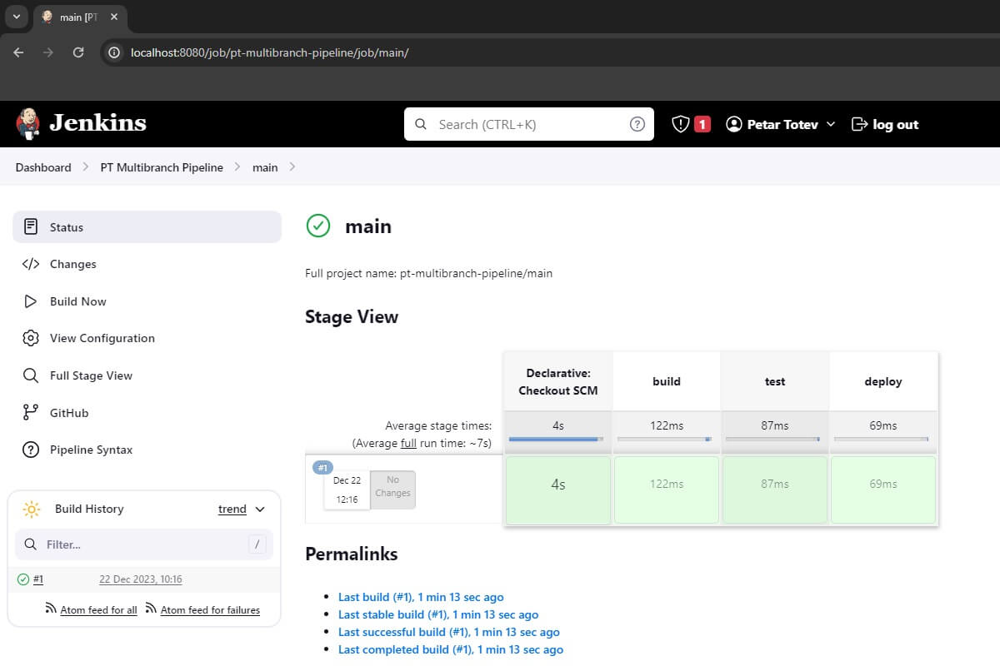
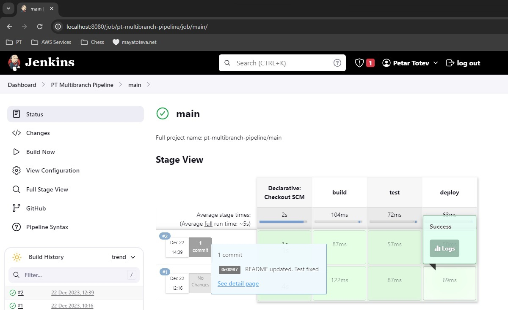
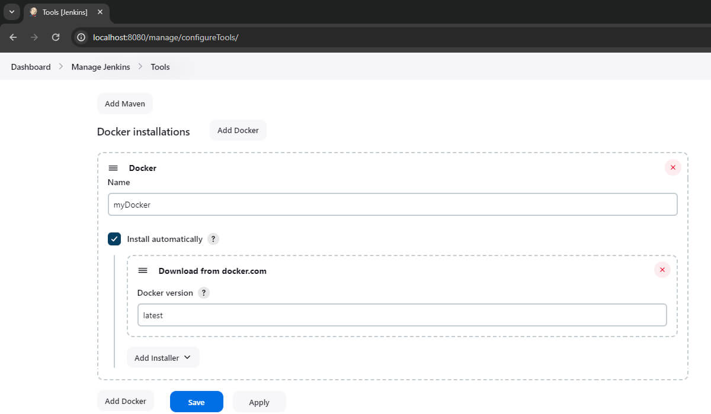
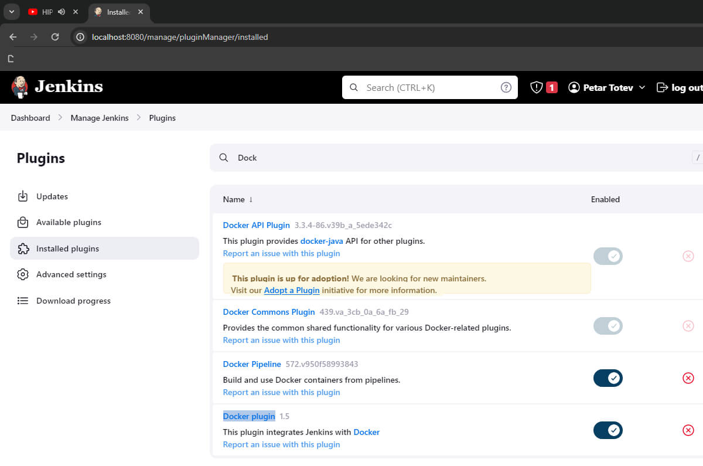
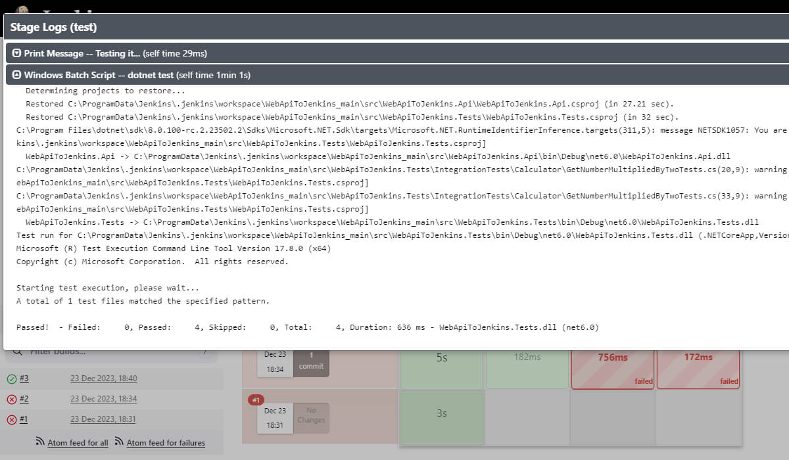
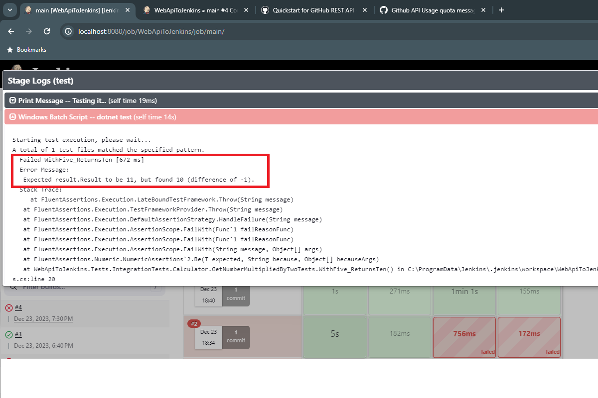

# PT_Demo_WebApiToJenkins

## Contents
- [Setup .NET Solution](#setup-net-solution)
    - [WebApiToJenkins.Api](#webapitojenkinsapi)
    - [WebApiToJenkins.Tests](#webapitojenkinstests)
    - [Jenkinsfile](#jenkinsfile)
- [Setup Jenkins in Docker](#setup-jenkins-in-docker)
    - [Initial Setup (Docker)](#initial-setup-docker)
    - [Setup Job using Jenkinsfile and GitHub (Docker)](#setup-job-using-jenkinsfile-and-github-docker)
    - [Update Jenkinsfile to Test Run (Docker)](#update-jenkinsfile-to-test-run-docker)
- [Setup Jenkins in Windows](#setup-jenkins-in-windows)
    - [Initial Setup (Windows)](#initial-setup-windows)
    - [Setup Job using Jenkinsfile and GitHub (Windows)](#setup-job-using-jenkinsfile-and-github-windows)
    - [Update Jenkinsfile to Test Run (Windows)](#update-jenkinsfile-to-test-run-windows)
- [Links](#links)
    - [Jenkins Installation (Bare-Metal)](#jenkins-installation-bare-metal)
    - [Others](#others)

## Setup .NET Solution

❗ Note that it is essential for the .NET Solution to be a part of a public GitHub repository:
<br>https://github.com/petartotev/PT_Demo_WebApiToJenkins

The WebApiToJenkins solution contains 2 projects:
- WebApiToJenkins.Api
- WebApiToJenkins.Tests

### WebApiToJenkins.Api

Create a .NET6 Web API project containing a single CalculatorController.cs with the following endpoint:

```
[GET] https://localhost:7000/api/calculator/multiplybytwo/{your-num-here}
```

Run the application and test it by using 5 for {your-num-here}.
<br>Here is the expected response:

```
{"result":10}
```

### WebApiToJenkins.Tests

Implement a series of NUnit integration tests implementing the abstract class `BaseTests` with the following Property to be called by tests:

```
Client = new WebApplicationFactory<Program>().CreateClient()
```

### Jenkinsfile

In the parent directory of the repository, create a simplified `Jenkinsfile` with the following content:

```
#!Groovy

pipeline {
    agent any

    stages {
        stage("build") {
            steps {
                echo 'Building it...'
            }
        }

        stage("test") {
            steps {
                echo 'Testing it...'
            }
        }

        stage("deploy") {
            steps {
                echo 'Deploying it...'
            }
        }
    }
}
```

## Setup Jenkins in Docker

### Initial Setup (Docker)

1. Pull latest Docker Image:

```
docker pull jenkins/jenkins
```

2. Run Jenkins in a `jenkins_master` Docker Container:

```
docker run -p 8080:8080 -p 50000:50000 -d -v jenkins_home:/var/jenkins_home --name jenkins_master jenkins/jenkins:latest
```

Output:
```
c2b809a66792e713c224694e56a34dc5cbec3d401298173c80961eae48456494
```

3. Get logs of `jenkins_master` Docker Container and extract the `Administrator password`:
```
docker logs c2b809a66792e713c224694e56a34dc5cbec3d401298173c80961eae48456494
```

Output:
```
Running from: /usr/share/jenkins/jenkins.war
webroot: /var/jenkins_home/war
2023-12-21 21:11:52.829+0000 [id=1]     INFO    winstone.Logger#logInternal: Beginning extraction from war file
2023-12-21 21:11:53.333+0000 [id=1]     WARNING o.e.j.s.handler.ContextHandler#setContextPath: Empty contextPath
2023-12-21 21:11:53.371+0000 [id=1]     INFO    org.eclipse.jetty.server.Server#doStart: jetty-10.0.18; built: 2023-10-27T01:59:58.245Z; git: 8545fd9bf4cd0d0838f626b405fd4963441546b7; jvm 17.0.9+9
2023-12-21 21:11:53.532+0000 [id=1]     INFO    o.e.j.w.StandardDescriptorProcessor#visitServlet: NO JSP Support for /, did not find org.eclipse.jetty.jsp.JettyJspServlet
2023-12-21 21:11:53.564+0000 [id=1]     INFO    o.e.j.s.s.DefaultSessionIdManager#doStart: Session workerName=node0
2023-12-21 21:11:53.969+0000 [id=1]     INFO    hudson.WebAppMain#contextInitialized: Jenkins home directory: /var/jenkins_home found at: EnvVars.masterEnvVars.get("JENKINS_HOME")
2023-12-21 21:11:54.061+0000 [id=1]     INFO    o.e.j.s.handler.ContextHandler#doStart: Started w.@3e15bb06{Jenkins v2.426.2,/,file:///var/jenkins_home/war/,AVAILABLE}{/var/jenkins_home/war}
2023-12-21 21:11:54.073+0000 [id=1]     INFO    o.e.j.server.AbstractConnector#doStart: Started ServerConnector@6955cb39{HTTP/1.1, (http/1.1)}{0.0.0.0:8080}
2023-12-21 21:11:54.083+0000 [id=1]     INFO    org.eclipse.jetty.server.Server#doStart: Started Server@7c098bb3{STARTING}[10.0.18,sto=0] @1655ms
2023-12-21 21:11:54.084+0000 [id=27]    INFO    winstone.Logger#logInternal: Winstone Servlet Engine running: controlPort=disabled
2023-12-21 21:11:54.248+0000 [id=35]    INFO    jenkins.InitReactorRunner$1#onAttained: Started initialization
2023-12-21 21:11:54.263+0000 [id=55]    INFO    jenkins.InitReactorRunner$1#onAttained: Listed all plugins
2023-12-21 21:11:54.820+0000 [id=38]    INFO    jenkins.InitReactorRunner$1#onAttained: Prepared all plugins
2023-12-21 21:11:54.824+0000 [id=49]    INFO    jenkins.InitReactorRunner$1#onAttained: Started all plugins
2023-12-21 21:11:54.829+0000 [id=49]    INFO    jenkins.InitReactorRunner$1#onAttained: Augmented all extensions
2023-12-21 21:11:54.978+0000 [id=33]    INFO    jenkins.InitReactorRunner$1#onAttained: System config loaded
2023-12-21 21:11:54.979+0000 [id=33]    INFO    jenkins.InitReactorRunner$1#onAttained: System config adapted
2023-12-21 21:11:54.979+0000 [id=46]    INFO    jenkins.InitReactorRunner$1#onAttained: Loaded all jobs
2023-12-21 21:11:54.981+0000 [id=46]    INFO    jenkins.InitReactorRunner$1#onAttained: Configuration for all jobs updated
2023-12-21 21:11:54.998+0000 [id=69]    INFO    hudson.util.Retrier#start: Attempt #1 to do the action check updates server
2023-12-21 21:11:55.339+0000 [id=46]    INFO    jenkins.install.SetupWizard#init:

*************************************************************
*************************************************************
*************************************************************

Jenkins initial setup is required. An admin user has been created and a password generated.
Please use the following password to proceed to installation:

1233dd31883d1238f60d1230ecf8123

This may also be found at: /var/jenkins_home/secrets/initialAdminPassword

*************************************************************
*************************************************************
*************************************************************

2023-12-21 21:12:08.722+0000 [id=53]    INFO    jenkins.InitReactorRunner$1#onAttained: Completed initialization
2023-12-21 21:12:08.737+0000 [id=26]    INFO    hudson.lifecycle.Lifecycle#onReady: Jenkins is fully up and running
2023-12-21 21:12:09.312+0000 [id=69]    INFO    h.m.DownloadService$Downloadable#load: Obtained the updated data file for hudson.tasks.Maven.MavenInstaller
2023-12-21 21:12:09.312+0000 [id=69]    INFO    hudson.util.Retrier#start: Performed the action check updates server successfully at the attempt #1
```

⚠️ If you previously pulled the Jenkins Image and run a Jenkins container using the command from step 2, you can find yourself in a situation in which the `docker logs` command output doesn't contain the `Administrator password` *(even after you deleted both the jenkins/jenkins Container and Image and started from scratch)*.

💡 You need to delete the running Container and start from scratch, replacing `-v jenkins_home:/var/jenkins_home` with `-v jenkins:/var/jenkins_home` (or any other new, unique name) in the `docker run` command, then executing it.
<br>The fix was taken from this [Stack Overflow article](https://stackoverflow.com/questions/56657041/jenkins-doesnt-show-me-initial-admin-password-at-second-build). 

4. Access Jenkins on [localhost:8080](http://localhost:8080/):
- Login:
    - user: admin
    - password: `Administrator password` from step 3
- Customize Jenkins > Choose [Install suggested plugins] and wait for the installation to finish
- Create First Admin User >
    - Username: your-username-here
    - Password: your-password-here
    - Confirm Password: your-password-here
    - Full name: your-full-name-here
    - E-mail address: your-email-here
    - [Save and Continue]
- Instance Configuration >
    - Jenkins URL: http://localhost:8080/
    - [Save and Finish]
- Jenkins is ready!
    - [Start using Jenkins]

### Setup Job using Jenkinsfile and GitHub (Docker)

0. Make sure you have Jenkinsfile in the parent directory of the repository (where .git is located).

1. Create a new Job in Jenkins UI:
- In Jenkins Home Page, choose [Create a job]
- Enter an item name: pt-multibranch-pipeline
- Choose [Multibranch Pipeline] (*Creates a set of Pipeline projects according to detected branches in one SCM repository*) and hit [OK]
- In [General]:
    - Display name: PT Multibranch Pipeline
    - Description: PT Multibranch Pipeline
    - Branch sources: GitHub
    - Credentials: none (if public repo)
    - Repository HTTPS URL: https://github.com/petartotev/PT_Demo_WebApiToJenkins
    - [Validate] in order to validate credentials and repo
    - Behaviours: leave as default (for now)
    - Build Configuration:
        - Mode: by Jenkinsfile
        - Script path: Jenkinsfile
    - Scan Multibranch Pipeline Triggers: 
        - [✓] Periodically if not otherwise run
        - Interval: 5 minutes?
    - [Apply], then [Save]

2. Open the newly created `main`Job:

- Go to Dashboard > PT Multibranch Pipeline > Open the `main` job



- Check if you have an initial build triggered:



3. Commit and push a change to the main branch and check if a new build in Jenkins will be triggered automatically:



### Update Jenkinsfile to Test Run (Docker)

1. Edit the `Jenkinsfile` (broken!):

```
#!Groovy

pipeline {
    agent {
        docker {
            image 'mcr.microsoft.com/dotnet/sdk:6.0'
        }
    }

    stages {
        stage('Initialize') {
            steps {
                script {
                    def dockerHome = tool 'myDocker'
                    echo "Docker Home: ${dockerHome}"
                }
            }
        }

        stage("build") {
            steps {
                echo 'Building it...'
            }
        }

        stage("test") {
            steps {
                echo 'Testing it...'
                script {
                    // Change directory to the test project
                    dir('./src/WebApiToJenkins.Tests') {
                        // Run NUnit tests using dotnet test
                        sh 'dotnet test'
                    }
                }
            }
        }

        stage("deploy") {
            steps {
                echo 'Deploying it...'
            }
        }
    }
}
```

⚠️⚠️⚠️ Unfortunately, a series of errors occurred due to the fact that the `dotnet test` could not be executed ("dotnet not found"). I tried to install it on the agent, defining an image, I tried executing a bunch of commands 

The only thing that worked is installing Jenkins locally in order for it to be able to use the dotnet CLI freely.

## Setup Jenkins in Windows

### Initial Setup (Windows)

0. Download and Install Java 21 from [here](https://www.oracle.com/java/technologies/downloads/#jdk21-windows).

1. Download Jenkins LTS for Windows from [here](https://www.jenkins.io/download/#downloading-jenkins).

2. Follow the instructions of [this page](https://www.jenkins.io/doc/book/installing/windows/) to get Jenkins installed (bare-metal).

### Setup Job using Jenkinsfile and GitHub (Windows)

This section should be identical to [Setup Job using Jenkinsfile and GitHub (Windows)](#setup-job-using-jenkinsfile-and-github-docker). 

### Update Jenkinsfile to Test Run (Windows)

0. Access [localhost:8080](http://localhost:8080/)

1. Go to Dashboard > Manage Systems > Tools (Configure tools, their locations and automatic installers.) > find `Docker installations` and set it:



2. Go to Dashboard > Manage Systems > Plugins (Configure tools, their locations and automatic installers.) > Available plugins > find `Docker (Docker plugin)` and `Docker plugins` and install them:



3. Update `Jenkinsfile`:

```
#!Groovy

pipeline {
    agent any

    stages {
        stage("build") {
            steps {
                echo 'Building it...'
            }
        }

        stage("test") {
            steps {
                echo 'Testing it...'
                script {
                    // Change directory to the test project
                    dir('./src/WebApiToJenkins.Tests') {
                        // Run NUnit tests using dotnet test
                        bat 'dotnet test'
                    }
                }
            }
        }

        stage("deploy") {
            steps {
                echo 'Deploying it...'
            }
        }
    }
}
```

⚠️ Needed to replace 'sh' with 'bat' due to [error: "cannot run program nohup" on windows](https://stackoverflow.com/questions/45140614/jenkins-pipeline-sh-fail-with-cannot-run-program-nohup-on-windows).

4. Git add, git commit, git push and check if a successful build that executed the NUnit tests was triggered:

```
git add .
git commit -m "Jenkinsfile updated"
git push
```



5. Next, you can break a test, commit and push to see an automatic build failing:



## Links

### Jenkins Installation (Bare-Metal)
- https://www.jenkins.io/doc/book/installing/windows/
- https://www.jenkins.io/download/#downloading-jenkins
- https://www.oracle.com/java/technologies/downloads/#jdk21-windows

### Others
- https://stackoverflow.com/questions/56657041/jenkins-doesnt-show-me-initial-admin-password-at-second-build
- https://stackoverflow.com/questions/62253474/jenkins-invalid-agent-type-docker-specified-must-be-one-of-any-label-none
- https://stackoverflow.com/questions/44791060/run-jenkins-pipeline-agent-with-sudo
- https://stackoverflow.com/questions/44850565/docker-not-found-when-building-docker-image-using-docker-jenkins-container-pipel
- https://www.jenkins.io/doc/book/pipeline/docker/#specifying-a-docker-label
- https://forums.docker.com/t/docker-not-found-in-jenkins-pipeline/31683
- https://medium.com/agilix/continuous-integration-diy-series-4-4-12ddaa815e90
- https://stackoverflow.com/questions/45140614/jenkins-pipeline-sh-fail-with-cannot-run-program-nohup-on-windows
